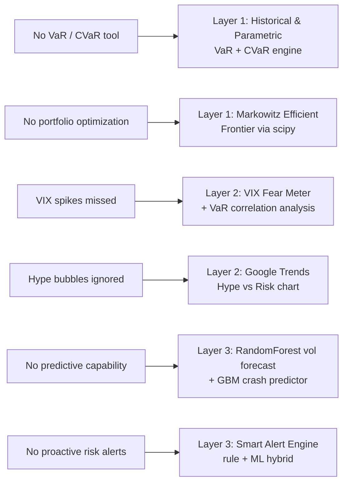

# Stock Portfolio Risk Analyzer — Problem Statement

## Overview

Retail investors increasingly manage diversified stock portfolios. However, understanding portfolio risk requires more than observing daily gains and losses.

Professional risk metrics such as **Value at Risk (VaR)**, **Sharpe Ratio**, **Beta**, and **Correlation Matrices** provide deeper insight into portfolio exposure. Most retail investors lack accessible tools that calculate these metrics interactively.

---

## The Problem

There is no integrated desktop tool that:

- Accepts portfolio holdings
- Processes historical price data
- Computes key financial risk metrics
- Simulates potential future scenarios
- Visualizes risk exposure interactively

---

## Challenges

Challenges include:

- Implementing financial risk models accurately
- Performing Monte Carlo simulations efficiently
- Handling matrix operations for correlation analysis
- Ensuring computational stability

Risk modeling requires precise statistical implementation.

---

## The Consequence

Without proper risk analysis:

| Problem | Impact |
|---|---|
| Investors underestimate portfolio volatility | Exposed to sudden drawdowns they cannot absorb |
| Diversification weaknesses go unnoticed | Portfolios appear diversified but are secretly correlated |
| Risk-adjusted performance remains unclear | A 30% return means nothing without knowing the risk taken |
| Decisions made on intuition | Emotional trading destroys returns |

Lack of structured analysis increases financial vulnerability.

---

## The Challenge

Can we build a **Stock Portfolio Risk Analyzer** that:

- Calculates VaR, Sharpe Ratio, Beta, and correlations
- Runs Monte Carlo simulations
- Supports scenario analysis (e.g., "What if asset X drops 20%?")
- Visualizes risk metrics in interactive dashboards
- Provides interpretable insights for investors

The objective is to bring professional-grade risk analytics to accessible desktop tools.

---

## Our Solution: Nivesh-Setu

> **See [`idea.md`](./idea.md) for the full solution design.**

**Nivesh-Setu** (Hindi: *Bridge to Investment*) directly addresses every problem and challenge listed above through a **three-layer architecture**:

Nivesh-Setu democratizes institutional-grade risk intelligence — no Bloomberg Terminal required.

---

## Objective

The objective is to bring **professional-grade, multi-signal risk analytics** to any retail investor through an open, free, web-based platform — enabling data-driven financial decisions with clarity, transparency, and confidence.
